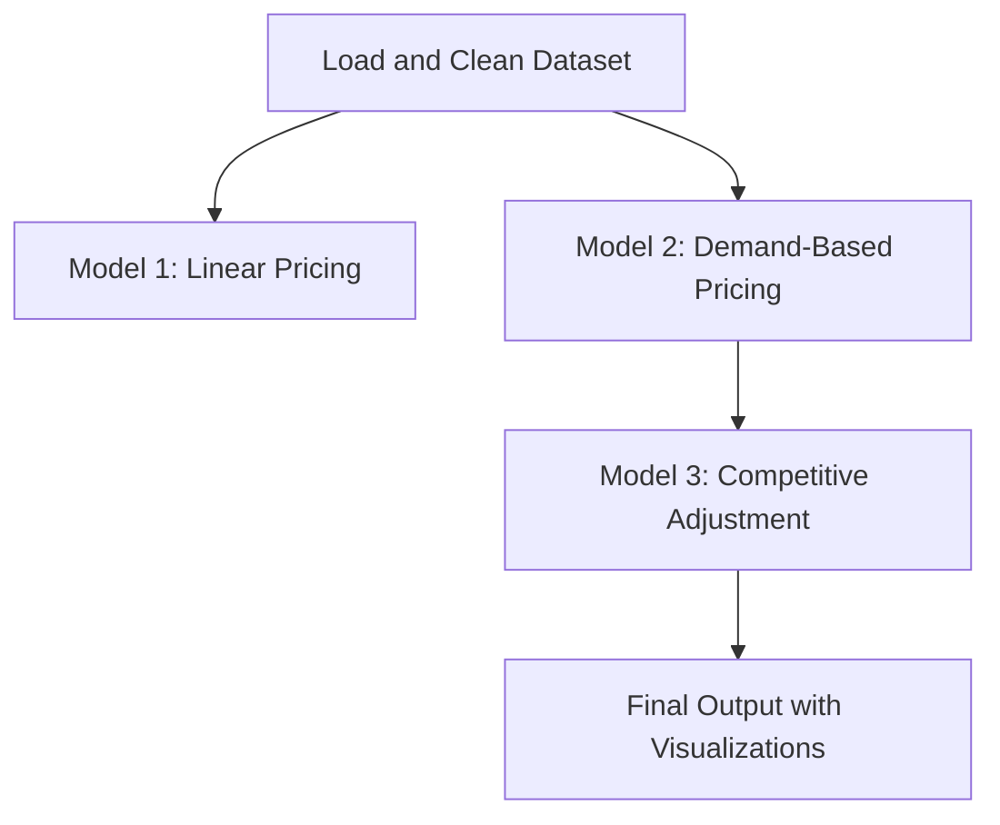

# Summer Analytics 2025 Capstone Project
## Dynamic Pricing Engine for Urban Parking Lots

This repository contains the complete implementation of a dynamic pricing engine for urban parking lots. The solution builds three progressively refined pricing models that factor in real-time operational data, demand characteristics, and spatial competition.

## Models Implemented

### Model 1: Linear Pricing
- Pricing is determined linearly based on the occupancy ratio of each lot.
- Serves as a baseline reference.

### Model 2: Demand-Based Pricing
- Incorporates five real-world demand factors:
  - Occupancy ratio
  - Queue length
  - Traffic conditions nearby
  - Special day indicator
  - Vehicle type weight
- Demand is normalized and mapped to a defined pricing range using a scaling function.

### Model 3: Competitive Pricing
- Enhances Model 2 by incorporating local market competition.
- Each lot's price is adjusted by comparing it to the average pricing of nearby lots within a 1 km radius (using the Haversine distance formula).
- Final price is updated based on the difference between a lot’s base price and the average price of its spatial neighbors at a given timestamp.

## Tech Stack Used

- Python
- Pandas
- NumPy
- Bokeh (for interactive plotting)
- Matplotlib
- Google Colab
- GitHub

## Architecture Diagram

## Project Workflow

1. Load and clean raw parking lot data.
2. Compute occupancy ratio and demand signals.
3. Implement Model 1 using a simple linear formula.
4. Implement Model 2 using a normalized multi-factor demand formula.
5. Implement Model 3 using spatial logic and timestamp alignment for competitive pricing.
6. Visualize the outputs using Bokeh for selected lots.

## Files Included

- `Summer_Analytics_2025_Capstone_Notebook.ipynb`: Complete implementation of all three models along with visualizations.
- `README.md`: Overview, architecture, and project documentation.

## Repository Instructions

- Ensure this repository remains **public**.
- Code is executable in Google Colab without modification (just upload the dataset).
- Reviewers can run each section sequentially and observe all plots and outputs.

## Submission Note

All requirements outlined in the Summer Analytics 2025 capstone instructions have been incorporated, including the architecture diagram, working code, and explanatory documentation.
